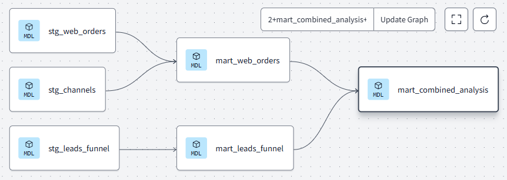

# Reporting Pipeline README

## **Overview**
This repository contains a data pipeline built with **dbt** for generating reporting tables to support analytical dashboards in Looker Studio. The pipeline processes raw data from multiple sources, applies transformations, and creates both aggregated and detailed reporting models.

### **Data Sources**
The raw data resides in BigQuery under the following tables:
- **`raw_data.channels`**: Contains information about marketing campaigns and their channel-level details.
- **`raw_data.leads_funnel`**: Provides data about leads and their progression through different stages of the sales funnel.
- **`raw_data.web_orders`**: Includes information about web orders, sessions, signups, and other web activity metrics.

## **Models**
The pipeline consists of the following dbt models:

### **1. Staging Models**
These models clean and standardize the raw data for further processing.

- **`stg_channels.sql`**:
  - Selects and renames fields from the `channels` table.
  - Provides campaign IDs, names, and channel-level details.

- **`stg_leads_funnel.sql`**:
  - Converts raw fields to appropriate data types.
  - Prepares the lead funnel data, including total leads, SQLs, meetings, signed leads, and POS Lite deals.

- **`stg_web_orders.sql`**:
  - Cleans and casts web orders data fields.
  - Calculates total spend, sessions, orders, and items dispatched.

### **2. Mart Models**
These models combine and aggregate the staging models to create data marts for reporting.

- **`mart_leads_funnel.sql`**:
  - Aggregates key metrics for the leads funnel.
  - Calculates various conversion rates (e.g., leads to SQLs, SQLs to meetings).
  - Adds KPIs such as cost per lead and cost per POS Lite deal.

- **`mart_web_orders.sql`**:
  - Aggregates metrics related to web orders.
  - Computes CTR and cost per order.

- **`mart_combined_analysis.sql`**:
  - Performs a full outer join between `mart_leads_funnel` and `mart_web_orders`.
  - Combines metrics from both marts and calculates the total combined spend.

### **3. Reporting Models**
These models prepare data for direct consumption by the reporting tools.

- **`rep_agg.sql`**:
  - Aggregates key metrics by date, country, campaign, and channel levels.
  - Calculates KPIs such as combined conversion rate and combined CTR.

- **`rep_complete.sql`**:
  - Provides a non-aggregated version of the combined data for more granular analysis.

## **Execution**
To run the pipeline:
1. Ensure dbt is installed and configured.
2. Execute the models using the following command:
   ```bash
   dbt run
   ```
3. Verify the output in BigQuery under the specified dataset.

## **Output Tables**
The following output tables are created in BigQuery:
- **`pos_lite_dbt.stg_channels`**
- **`pos_lite_dbt.stg_leads_funnel`**
- **`pos_lite_dbt.stg_web_orders`**
- **`pos_lite_dbt.mart_leads_funnel`**
- **`pos_lite_dbt.mart_web_orders`**
- **`pos_lite_dbt.mart_combined_analysis`**
- **`pos_lite_dbt.rep_agg`**
- **`pos_lite_dbt.rep_complete`**



## **Next Steps**
1. Connect the `rep_agg` and `rep_complete` tables to Looker Studio.
2. Design a dashboard in Looker Studio to visualize key KPIs such as conversion rates, total spend, and CTR.

## **Repository Structure**
```
.
├── models
│   ├── mart
│   │   ├── mart_combined_analysis.sql
│   │   ├── mart_leads_funnel.sql
│   │   └── mart_web_orders.sql
│   ├── reporting
│   │   ├── rep_agg.sql
│   │   └── rep_complete.sql
│   └── staging
│       ├── stg_channels.sql
│       ├── stg_leads_funnel.sql
│       └── stg_web_orders.sql
├── dbt_project.yml
└── README.md
```